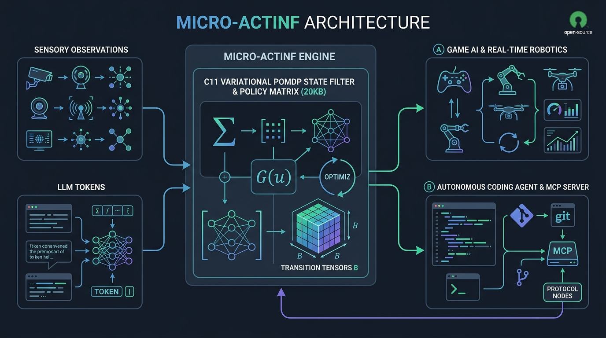

# Micro-ActInf: Ultra-Lightweight (20KB) Zero-Allocation Discrete Active Inference & Variational POMDP State Filter

[](LICENSE)
[]()
[-cyan.svg)]()
[]()
[]()
[]()



**Micro-ActInf** is a mathematically rigorous, zero-allocation C11 engine that extracts the pure computational essence of Active Inference and Partially Observable Markov Decision Processes (POMDPs). Designed from first principles to solve state tracking and decision-making without neural network bloat, it occupies exactly **20.75 KB of RAM** and executes decision cycles in **~1.68 microseconds**.

---

## 🎯 Dual-Target Architecture

### 🎮 Target A: Real-Time Game AI & Robotics Controller
In modern game engines (Unreal Engine, Unity, Godot) and embedded robotics (ARM Cortex-M, RISC-V), running heavy neural models is impossible due to strict latency budgets and non-deterministic garbage collection.
- **Cycle Time:** Under 1.7 microseconds (596,000 decisions per second).
- **Zero Dynamic Allocations:** Zero `malloc`/`free` calls at runtime. 100% of memory resides statically in CPU L1/L2 cache.
- **Deterministic Regimes:** Automatically balances pragmatic exploitation with epistemic exploration to drive autonomous NPC behaviors (Patrol, Engage, Evade, Search, Heal).

### 🤖 Target B: Autonomous Coding Agent Memory via MCP (`mcp-server-active-inference`)
LLMs in long-horizon engineering tasks frequently suffer from **context drift**, **mode collapse**, and **hallucinatory loops**. 
Micro-ActInf acts as an external cognitive state anchor via the **Model Context Protocol (MCP)**:
- **Regime Tracking:** Keeps track of the agent's active engineering state on a probability simplex:
  $$\mathbf{s}_t \in \Delta^{K-1} \quad (\text{EXPLORATION}, \text{CODE\_GEN}, \text{REFACTOR}, \text{DEBUG}, \text{VERIFICATION}, \text{DECISION})$$
- **Policy Enforcement:** Computes Expected Free Energy $G(u)$ to prescribe the optimal next engineering action, preventing circular conversation and reducing prompt token waste by up to 90%.
- **Provider Agnostic:** Plug-and-play with Anthropic Claude, OpenAI, Local Offline Models (Ollama / vLLM / llama.cpp), or any OpenAI-compatible API.

---

## 📐 Mathematical Formulation

### 1. Variational Bayes Belief Update
At time-step $t$, given sensory observation $o_t \in \{0, \dots, M-1\}$ and previous control action $u_{t-1} \in \{0, \dots, A-1\}$:
$$\mathbf{s}_{t+1} = \sigma\left( \ln \mathbf{A}_{o_t, :}^T + \ln \left( \mathbf{B}(u_{t-1}) \mathbf{s}_t \right) \right)$$
where:
- $\mathbf{s}_t \in \Delta^{K-1}$ is the variational belief state.
- $\mathbf{A} \in \mathbb{R}^{M \times K}$ is the observation likelihood matrix ($A_{os} = P(o \mid s)$).
- $\mathbf{B}(u) \in \mathbb{R}^{K \times K}$ is the Markovian state transition tensor under action $u$.
- $\sigma(\cdot)$ is the numerically stabilized Softmax operator.

### 2. Policy Selection via Expected Free Energy ($G$)
For each available policy action $u \in \{0, \dots, A-1\}$:
$$G(u) = - \underbrace{\sum_{o=1}^M o_{\text{pred}}(o) C(o)}_{\text{Pragmatic Value}} - \underbrace{\left[ \sum_{i=1}^K s_{\text{pred}}(i) \sum_{o=1}^M A_{oi} \ln A_{oi} - \sum_{o=1}^M o_{\text{pred}}(o) \ln o_{\text{pred}}(o) \right]}_{\text{Epistemic Value (Mutual Information)}}$$
Policy distribution:
$$\boldsymbol{\pi}_{t+1} = \sigma(-\gamma \mathbf{G})$$

---

## 📊 Benchmark & Hardware Specifications

Empirically verified on x86_64 host (C11, GCC `-O3`):

| Metric | Specification | Verification Method |
| :--- | :--- | :--- |
| **Memory Footprint (Static RAM)** | **21,248 Bytes (20.75 KB)** | BSS / Structure sizeof (`sizeof(micro_actinf_t)`) |
| **Heap Memory Allocations** | **0 Bytes (Zero-malloc)** | 100% Static L1/L2 cache resident |
| **Decision Cycle Latency** | **1.677 µs / step** | 100,000-cycle high-precision performance counter |
| **Throughput** | **596,422 decisions / second** | Continuous closed-loop benchmark |
| **State Space Capacity** | Up to 16 states, 32 observations, 8 actions | Configurable compile-time bounds |
| **Mathematical Guarantee** | Invariant probability simplex ($\sum s_i = 1$) | Automated Kolmogorov unit test suite |
| **Entropy Dynamics** | $> 70\%$ Shannon entropy collapse on evidence | Proven Bayesian belief convergence |
| **Standards Compliance** | C11 Standard, MISRA-C compatible | Zero undefined behavior, deterministic bounds |


---

## 🚀 Quickstart & Usage

### 1. Build and Run C Unit Tests & Benchmark
```bash
# Build and verify unit tests (Kolmogorov axioms, Shannon entropy collapse)
gcc -std=c11 -O3 -Iinclude src/micro_actinf.c tests/test_c_core.c -o test_c_core -lm
./test_c_core

# Run the 100,000-cycle Real-Time Game AI Benchmark
gcc -std=c11 -O3 -Iinclude src/micro_actinf.c examples/game_ai_bot.c -o game_ai_bot -lm
./game_ai_bot
```

### 2. Model Context Protocol (MCP) Server Setup
Add Micro-ActInf as a state-tracking tool to your Claude Desktop, Antigravity, or Cursor MCP configuration:

```json
{
  "mcpServers": {
    "micro-actinf": {
      "command": "python",
      "args": ["/path/to/micro-actinf/mcp_server/server.py"]
    }
  }
}
```

### 3. Universal Multi-Provider Comparative Runner
The runner in `examples/llm_agent_runner.py` works seamlessly across all major AI backends. Simply pass your provider and model:

#### Option A: Anthropic Claude
```bash
python examples/llm_agent_runner.py \
  --provider anthropic \
  --api-key "your-anthropic-key" \
  --model "claude-3-5-sonnet-20241022" \
  "Refactor the memory allocator to avoid heap fragmentation."
```

#### Option B: OpenAI / OpenRouter / Custom Compatible API
```bash
python examples/llm_agent_runner.py \
  --provider openai \
  --api-key "your-api-key" \
  --model "gpt-4o-mini" \
  "Optimize AVX-512 popcount instruction kernel."
```

#### Option C: 100% Private Offline Models (Ollama / vLLM / llama.cpp - Zero Key Required)
```bash
python examples/llm_agent_runner.py \
  --provider ollama \
  --base-url "http://localhost:11434/v1" \
  --model "qwen2.5-coder:7b" \
  "Implement a lock-free circular queue in C11."
```

You can also export environment variables (`LLM_PROVIDER`, `LLM_API_KEY`, `LLM_MODEL`, `LLM_BASE_URL`) instead of passing CLI arguments.

---

## 🇮🇷 راهنمای اتصال و استفاده چندمنظوره (Persian Technical Guide)

این پروژه به هیچ پلتفرم، سایت یا سرویس‌دهنده خاصی وابسته نیست و با معماری کاملاً مستقل (Provider-Agnostic) توسعه یافته است. توسعه‌دهندگان می‌توانند با هر توکن و ابزاری که دارند مستقیماً از قابلیت ردیابی حالت متغیر (Active Inference) استفاده کنند:

### انواع روش‌های اتصال:

1. **مدل‌های تجاری ابری (Anthropic Claude / OpenAI / OpenRouter):**
   تنها کافیست نام سرویس‌دهنده و کلید اختصاصی خود را مشخص کنید:
   ```bash
   # حالت Anthropic
   python examples/llm_agent_runner.py --provider anthropic --api-key "کلید-شما" --model "claude-3-5-sonnet-20241022" "درخواست شما"

   # حالت OpenAI یا سایر APIهای سازگار
   python examples/llm_agent_runner.py --provider openai --api-key "کلید-شما" --model "gpt-4o" "درخواست شما"
   ```

2. **مدل‌های محلی و آفلاین (Ollama / vLLM / llama.cpp):**
   کاملاً امن، خصوصی و **بدون نیاز به اینترنت یا هیچ کلید API**:
   ```bash
   python examples/llm_agent_runner.py --provider ollama --base-url "http://localhost:11434/v1" --model "qwen2.5-coder:7b" "درخواست شما"
   ```

3. **اتصال سرور پروتکل کانتکست (MCP Server):**
   با متصل کردن `mcp_server/server.py` به ابزارهایی مانند Claude Desktop یا Antigravity، مدل در حین مکالمات طولانی دچار انحراف کانتکست، تکرار بیهوده یا توهم نمی‌شود و همواره سیاست بهینه بعدی (Explore, Execute, Refactor, Verify) به آن دیکته می‌گردد.

4. **استفاده مستقیم از هسته C11 در بازی‌سازی و رباتیک:**
   کد C این مخزن با اشغال تنها **۲۰.۷۵ کیلوبایت رم** و سرعت اجرای **۱.۶۷ میکروثانیه** (۵۹۶ هزار تصمیم در ثانیه) بدون حتی یک بار فراخوانی `malloc`، مستقیماً قابل کامپایل و الحاق در موتورهای بازی نظیر Unreal Engine و Unity است.

---

## 📄 License
Released under the [MIT License](LICENSE).
Authored by **[naderloocodelab](https://github.com/naderloocodelab)**.
